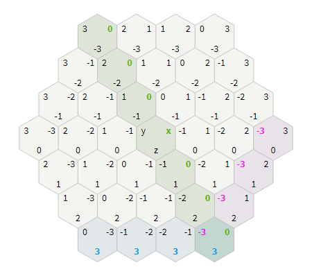

# Miracle_Saiblo

这里是**智能体比赛 - 神迹之战**的开发日志。

现在是2020年4月8日10:20（UTC+8）。

## 初始化

语言选择C++，预计不会用到强化学习框架。

核心决策应该会使用打分机制，给予每个条件一定的数值，比如能直接摧毁水晶数值记为极大，每次选择数值最大的方案之行。这样方便最终决策的统一性。

## 细节

如果 **攻击者** 同时也在 **被攻击者** 的攻击范围内， **被攻击者** 会对 **攻击者** 进行 **反击** ，造成等同于 **被攻击**

**者 攻击力** 的伤害。

回合结束时，我方生物应该尽量处在敌方攻击范围外，或者可以反击敌方。若不行，不能放在下回合直接被秒的地方（人海战术？假如3个单位同时攻击一个单位）。

同样，利用跳跃放置+后方大龙，可以构建防线。

如无特殊 **词条** ，一个生物在一个回合内不可以既 **移动** ，又 **攻击** 。

现在是2020年4月19日17:00（UTC+8）。(ddl选手...记得5.3日ddl)

先阅读SDK，看不太懂但大概知道我知道地图上的全部信息，甚至可以推算出对手费用（估计用不到）。制表，列出可用的信息。

现在是2020年4月26日21:00（UTC+8）。(真没时间写，哭)
（写到2130吧）
两种思路：之前的积分进攻流，以及圣盾守家流。
坐标使用Cube coordinates记录，见https://www.cnblogs.com/DHUtoBUAA/p/7192315.html

Cube coordinates：一种全新的看待正六边形的方式，它把正六边形看作具有三个轴，并且满足x+y+z=0的性质，并且我们可以使用标准的方法实现坐标系的加减乘除和求距离。Cube坐标系的原理和其它性质可以参见文献。



　　因为我们已经有针对方形网格和cube网格的计算方法，使用cube坐标系允许我们对六边形采用这些算法。当这个算法要和其他坐标系交互时，我会把其他坐标系转换为cube坐标系，然后计算结束后在转换为其他坐标系。

　　Axial coordinates:该坐标系是由cube坐标系中三个轴中的两个组成的。因为在cube坐标系有x+y+z=0的限制，所以第三个轴是多余的。Axial coordinates主要应用于地图存储和对用户的显示。Axial coordinates相比offset grids的优点是坐标系更清楚，劣势是当存储一个长方形地图时显得有点怪异。

　　总结：Offset coordinates因为符合square grids通用的笛卡尔坐标系，是我们最容易想到的坐标系，但是因为两轴中的一轴必须跟随变化，是一件复杂的事情；Cube and axial systems随着增长而变化并且具有相对简单的计算方法，但是在存储时具有一定的复杂度。

## 启动

毫无悬念的拖到了最后三天...

现在是2020年5月1日19:48（UTC+8）。

开始写```ai.cpp```，首要目标是战胜样例AI。

### 建立数据统计机制

- 完成地狱火的基本决策，越靠近对方神迹/对对方伤害越大。

- （现在是2020年5月2日12:18（UTC+8））每个单位独立的数据，包括地图评分和攻击趋势，使用一个类来记录每个单位的历史，趋势和下一步指令。
- 流程：
  - 考虑是否使用神器
  - 扫描敌方单位，记录/预测，方便针对（记录历史位置）
  - 我方存在单位分配任务（占点/送塔/进攻神迹/周边应对）&Group机制（收益最大化）
  - 我方单位移动（牧师和防对面龙）
  - 我方存在单位攻击
  - 我方存在单位移动（不攻击的都移动一下）
  - 选择驻扎点创建新单位
  - 我方存在单位再次分配任务，如果亏费分配送塔任务

